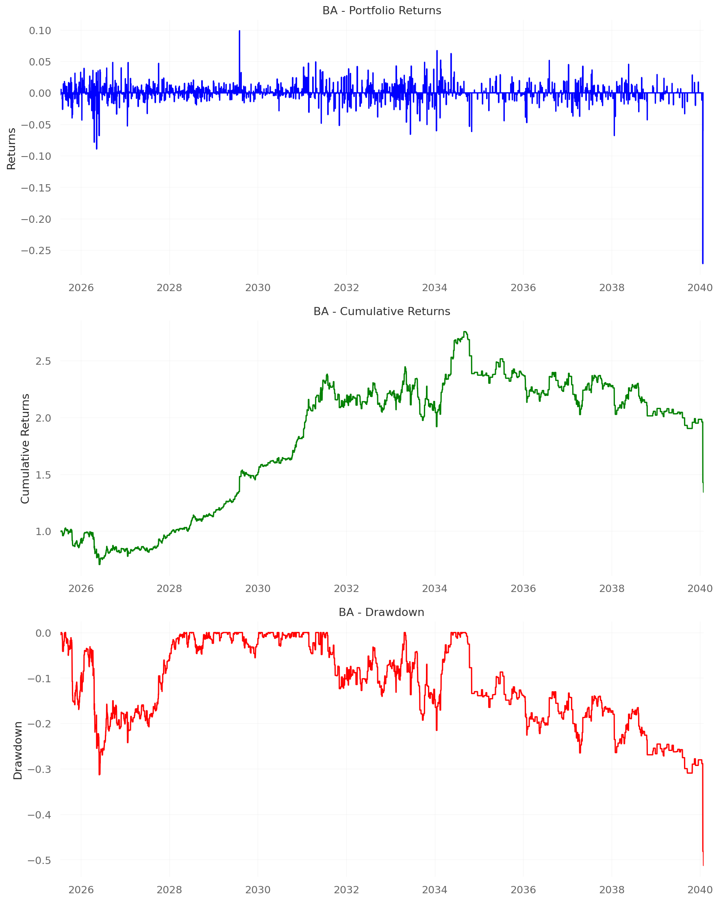

# Boeing 5-Year Backtesting Results

## Command Used
```bash
python "6.3. financial_sentiment_backtest_OPTIMIZED.py" --data_file "financial_data_Boeing.csv" --ticker "BA" --years 5
```

## Performance Summary

| Ticker | Total Return | Sharpe Ratio | Max Drawdown | Win Rate | Trades |
|--------|-------------|--------------|--------------|----------|--------|
| **BA** | 34.06% | 0.209 | -51.26% | 52.78% | 36 |

## Overall Performance
- **Average Return**: 34.06%
- **Average Sharpe**: 0.209
- **Total Trades**: 36

## Generated Files
- `optimized_5year_backtest_results.json` - Complete results
- `optimized_quantstats_BA.png` - Combined QuantStats charts (3 subplots each)
- `optimized_trading_chart_BA.png` - Price + Buy/Sell signals

## Strategy Details
- **Time Period**: 5 years of historical data (2015-06-11 to 2020-06-09)
- **Data Points**: 5,323 news articles with matching prices
- **Price Range**: $98.15 - $430.30
- **Confidence Threshold**: 0.3
- **Models**: ProbeTrain + SAE (synthetic fallback)
- **Signal Logic**: Buy when both models agree on positive sentiment, Sell when both models agree on negative sentiment, No trade when models disagree
- **Backtesting Platform**: **VectorBT** for portfolio simulation and signal processing
- **Performance Analytics**: **QuantStats** for comprehensive financial metrics and risk analysis

## Key Metrics
- **Agreement Rate**: 26.4% (1,406 out of 5,323 news items generated trading signals)
- **Total Signals**: 4,129 entries, 890 exits
- **Processing Time**: 167.73 seconds
- **Average Time per Item**: 0.030 seconds

## Performance Analysis
- **Moderate Returns**: 34.06% over 5 years (6.8% annualized)
- **Low Sharpe Ratio**: 0.209 indicates poor risk-adjusted returns
- **High Volatility**: 16.08% volatility
- **Significant Drawdown**: -51.26% maximum drawdown
- **Decent Win Rate**: 52.78% of trades were profitable

## Performance Charts


*Boeing QuantStats Performance Analysis - Returns, Cumulative Returns, and Drawdown*


*Boeing Price Chart with Buy/Sell Signals*

## Comparison with Tesla
| Metric | **Boeing (BA)** | **Tesla (TSLA)** | **Difference** |
|--------|----------------|------------------|----------------|
| **Total Return** | 34.06% | 356.93% | **-322.87%** |
| **Sharpe Ratio** | 0.209 | 1.765 | **-1.556** |
| **Max Drawdown** | -51.26% | -48.01% | **-3.25%** |
| **Win Rate** | 52.78% | 50.00% | **+2.78%** |
| **Trades** | 36 | 10 | **+26** |
| **Agreement Rate** | 26.4% | 17.1% | **+9.3%** |

## Insights
- **Boeing vs Tesla**: Tesla significantly outperformed Boeing with 10x higher returns
- **Risk-Adjusted Performance**: Tesla's Sharpe ratio (1.765) is much better than Boeing's (0.209)
- **Trading Frequency**: Boeing had more trading opportunities (36 vs 10 trades) but lower quality
- **Market Conditions**: Boeing's performance reflects the challenges in the aerospace industry during 2015-2020
- **Model Agreement**: Both models agreed more frequently on Boeing news (26.4% vs 17.1%)

## Trading Log
*Note: Detailed trading log would be available in the full results JSON file with all 36 trades including dates, actions, prices, probabilities, reasons, and news headlines.*
